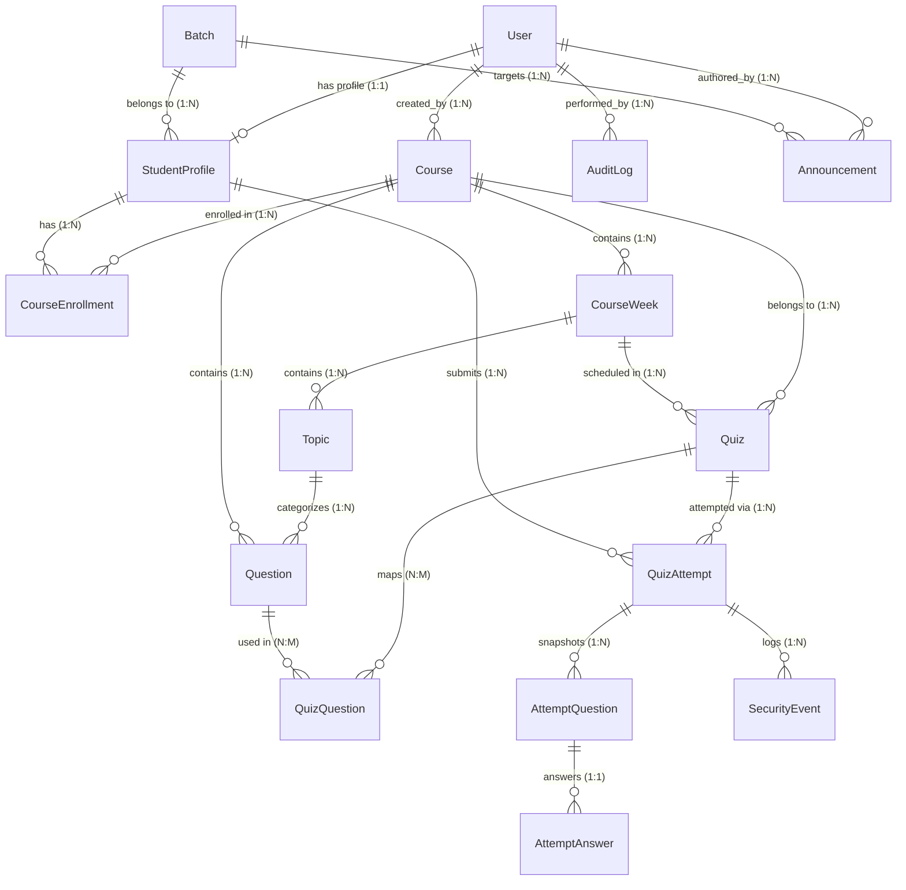

# Relational Database Schema Specification
## KDTechX Learning & Assessment Portal
**Document ID:** `DB-KDTECHX-2026-01`  
**Engine:** PostgreSQL 16+ / SQLite (Local Dev fallback)  
**Status:** Verified in Active Database (`db.sqlite3` / Render Postgres)  

---

## 1. Entity-Relationship Architecture



---

## 2. Table Specifications & Indexes

### 2.1 Identity: `accounts_user`
| Column | Type | Constraints | Description |
|---|---|---|---|
| `id` | BigAutoField | PRIMARY KEY | Unique user ID |
| `username` | VARCHAR(150) | UNIQUE, NOT NULL, INDEX | Login identifier |
| `email` | VARCHAR(254) | UNIQUE, NOT NULL, INDEX | Primary email address |
| `password` | VARCHAR(128) | NOT NULL | PBKDF2 SHA-256 hashed password |
| `role` | VARCHAR(20) | NOT NULL, DEFAULT 'STUDENT', INDEX | `ADMIN` or `STUDENT` |
| `avatar` | VARCHAR(500) | NULLABLE | Profile picture URL |
| `is_active` | BOOLEAN | NOT NULL, DEFAULT TRUE | Soft deactivation flag |
| `is_staff` | BOOLEAN | NOT NULL, DEFAULT FALSE | Django administrative access |
| `is_superuser` | BOOLEAN | NOT NULL, DEFAULT FALSE | Full permission flag |
| `date_joined` | TIMESTAMP | NOT NULL | Registration timestamp |

### 2.2 Batches: `batches_batch`
| Column | Type | Constraints | Description |
|---|---|---|---|
| `id` | BigAutoField | PRIMARY KEY | Unique batch ID |
| `name` | VARCHAR(150) | NOT NULL | Cohort name (e.g., "Full Stack 2026") |
| `code` | VARCHAR(50) | UNIQUE, NOT NULL, INDEX | Batch code (e.g., `batch_pfs_2026`) |
| `description` | TEXT | NULLABLE | Cohort notes |
| `status` | VARCHAR(20) | NOT NULL, DEFAULT 'active', INDEX | `active`, `completed`, `archived` |

### 2.3 Students: `students_studentprofile`
| Column | Type | Constraints | Description |
|---|---|---|---|
| `id` | BigAutoField | PRIMARY KEY | Profile ID |
| `user_id` | BigInteger | UNIQUE, FK(`accounts_user.id`), CASCADE | 1:1 user linkage |
| `student_id` | VARCHAR(50) | UNIQUE, NOT NULL, INDEX | College / Candidate ID |
| `batch_id` | BigInteger | NULLABLE, FK(`batches_batch.id`), SET_NULL | Cohort association |
| `phone` | VARCHAR(30) | NULLABLE | Contact telephone |
| `status` | VARCHAR(20) | NOT NULL, DEFAULT 'active', INDEX | `active`, `inactive`, `suspended` |
| `last_active_at` | TIMESTAMP | NULLABLE | Last session activity |

### 2.4 Courses: `courses_course` & `courses_courseenrollment`
* **`courses_course`**:
  - `code` (VARCHAR 50, UNIQUE, INDEX): Course identifier (e.g., `PY-101`)
  - `name` (VARCHAR 200, NOT NULL)
  - `level` (VARCHAR 30): `beginner`, `intermediate`, `advanced`
  - `status` (VARCHAR 20, INDEX): `draft`, `published`, `archived`
  - `duration_weeks` (PositiveInteger, DEFAULT 8)
* **`courses_courseenrollment`**:
  - Composite Unique: `(student_id, course_id)`
  - `status`: `enrolled`, `completed`, `dropped`

### 2.5 Curriculum: `curriculum_courseweek` & `curriculum_topic`
* **`curriculum_courseweek`**:
  - Composite Unique: `(course_id, week_number)`
  - `title`, `description`, `order`
* **`curriculum_topic`**:
  - FK to `curriculum_courseweek` (`related_name='topics'`)
  - `title`, `summary`, `order`

### 2.6 Question Bank: `questions_question`
* Fields: `course_id` (FK), `topic_id` (FK, NULLABLE), `question_text` (TEXT), `option_a`, `option_b`, `option_c`, `option_d` (TEXT), `correct_answer` (VARCHAR 1: A/B/C/D), `difficulty` (VARCHAR 20: `easy`, `medium`, `hard`), `marks` (Decimal 5,2), `explanation` (TEXT).
* Indexes:
  - `(course_id, difficulty)`
  - `(topic_id)`

### 2.7 Quizzes: `quizzes_quiz` & `quizzes_quizquestion`
* Fields: `course_id` (FK), `week_id` (FK, NULLABLE), `title` (VARCHAR 200), `duration_minutes` (PositiveInteger), `total_marks` (Decimal 6,2), `pass_percentage` (Decimal 5,2), `start_at`, `deadline`, `max_attempts` (PositiveInteger, DEFAULT 1), `random_questions` (BOOLEAN), `random_options` (BOOLEAN), `negative_marking` (BOOLEAN), `negative_marks` (Decimal 4,2, DEFAULT 0.25), `status` (VARCHAR 20: `draft`, `published`, `archived`).
* Security deterrence fields: `require_fullscreen` (BOOLEAN), `tab_warning_limit` (PositiveInteger), `prevent_copy` (BOOLEAN).

### 2.8 Assessment Attempts: `attempts_quizattempt`, `attempts_attemptquestion`, `attempts_attemptanswer`
* **`attempts_quizattempt`**:
  - Composite Unique: `(quiz_id, student_id, attempt_number)`
  - Indexes: `(quiz_id, student_id, status)`, `(status, deadline_at)`
  - Fields: `status` (`IN_PROGRESS`, `SUBMITTED`, `TIMED_OUT`, `TERMINATED`), `score` (Decimal 6,2), `percentage` (Decimal 5,2), `is_passed` (BOOLEAN), `correct_count`, `wrong_count`, `unanswered_count`, `time_taken_seconds`, `tab_violations`.
* **`attempts_attemptquestion`**:
  - Persists exact snapshot order and scrambled option mapping: `option_mapping` JSONField (e.g., `{"A": "C", "B": "A", "C": "D", "D": "B"}`).
  - Composite Unique: `(attempt_id, question_id)`.
* **`attempts_attemptanswer`**:
  - 1:1 with `AttemptQuestion` (`attempt_question_id`).
  - `selected_option` (VARCHAR 1), `is_correct` (BOOLEAN), `marks_awarded` (Decimal 5,2).

### 2.9 Audit & Monitoring: `audit_securityevent` & `audit_auditlog`
* **`audit_securityevent`**: `attempt_id` (FK), `event_type` (`TAB_SWITCH`, `FULLSCREEN_EXIT`, `CLIPBOARD_ATTEMPT`, `DUPLICATE_TAB`), `metadata` (JSONField), `created_at`.
* **`audit_auditlog`**: `user_id` (FK, NULLABLE), `action` (VARCHAR 100), `ip_address`, `details` (JSONField), `created_at`.

---

## 3. Query Optimization Patterns

To ensure rapid sub-50ms page renders across large cohort datasets:
1. **Student Dashboard:**
   ```python
   QuizAttempt.objects.filter(student=profile)\
       .select_related('quiz', 'quiz__course')\
       .order_by('-started_at')[:5]
   ```
2. **Admin Cohort Overview:**
   ```python
   Course.objects.filter(status='published')\
       .prefetch_related('enrollments__student__user', 'quizzes__attempts')\
       .annotate(total_students=Count('enrollments', distinct=True))
   ```
3. **Assessment Snapshot Engine:**
   ```python
   attempt.question_snapshots\
       .select_related('question')\
       .prefetch_related('answer')\
       .order_by('display_order')
   ```
